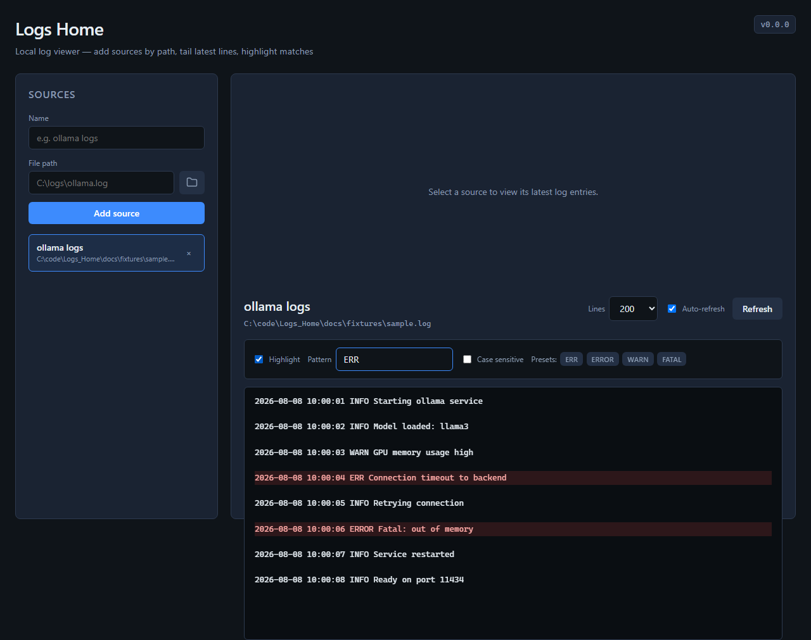

# Logs Home

<!-- APP_SCREENSHOT -->

<!-- /APP_SCREENSHOT -->

Local-first web app for watching log and text files on your machine. Register named sources by path, tail the latest lines in the browser, and highlight matches (for example lines containing `ERR`).

The UI is served by a small FastAPI server on localhost. A browser alone cannot read arbitrary disk paths; the server is what makes path-based log viewing possible.

---

## Requirements

| Dependency | Needed for |
|------------|------------|
| **Python 3.10+** | Running the app |
| **Git for Windows** (or Git with a POSIX shell) | Pre-commit screenshot hook |
| **Playwright Chromium** (optional) | Auto-updating the README screenshot on commit |

---

## Quick start

From the project root (`C:\code\Logs_Home` or wherever you cloned the repo):

```bash
# 1. Create and activate a virtual environment (recommended)
python -m venv .venv

# Windows PowerShell
.\.venv\Scripts\Activate.ps1

# macOS / Linux
# source .venv/bin/activate

# 2. Install runtime dependencies
pip install -r requirements.txt

# 3. Start the server
uvicorn backend.main:app --reload --host 127.0.0.1 --port 8000
```

Open **[http://127.0.0.1:8000](http://127.0.0.1:8000)** in your browser.

You should see the app version (for example `v0.02`) in the top-right of the page.

### If port 8000 is already in use

`WinError 10013` or “address already in use” usually means another process (often a leftover uvicorn) is bound to port 8000.

**Option A — free the port (PowerShell):**

```powershell
netstat -ano | findstr :8000
taskkill /PID <pid_from_last_column> /F
```

**Option B — use another port:**

```bash
uvicorn backend.main:app --reload --host 127.0.0.1 --port 8001
```

Then open `http://127.0.0.1:8001`.

---

## Using the app

### Add a log source

1. Enter a **name** (for example `ollama logs` or `amd logs`).
2. Enter the **full path** to a `.log` or `.txt` file on this machine, or click the **folder** button to open the Windows file picker.
3. Click **Add source**.

If the name field is empty when you browse, the app suggests a name from the filename (for example `ollama.log` → `ollama`).

Sources are stored in `data/sources.json` (created on first save). That file is gitignored so your personal paths are not committed.

### View logs

1. Click a source in the left list.
2. The right panel shows the latest lines (newest toward the bottom).
3. Choose how many lines to load: **50 / 200 / 500 / 1000**.
4. Leave **Auto-refresh** on to poll every ~2 seconds, or click **Refresh** manually.

### Highlight matching lines

1. Enable **Highlight**.
2. Set a **pattern** (default suggestion: `ERR`). Any line containing that substring is highlighted.
3. Optionally turn on **Case sensitive**.
4. Use presets **ERR**, **ERROR**, **WARN**, or **FATAL** to fill the pattern quickly (still editable).

Highlighting runs in the browser; it does not change the log file.

### Delete a source

Click **×** on a source in the list. This only removes the saved entry; it does not delete the log file on disk.

### File picker notes

- The folder button asks the **server** to open a native OS dialog, so you get a real absolute path.
- The dialog appears on the machine where uvicorn is running (your desktop for normal local use).
- It needs a desktop session; it will not work in a fully headless environment without a display.

---

## Project layout

```
Logs_Home/
  README.md
  requirements.txt          # Runtime: FastAPI, uvicorn, pydantic
  requirements-dev.txt      # + Playwright for screenshots
  backend/
    main.py                 # FastAPI app and API routes
    sources_store.py        # Named sources JSON store
    tail.py                 # Efficient last-N-lines reader
    file_picker.py          # Native OS file dialog
    version.py              # APP_VERSION (shown in the UI)
    static/                 # Web UI (HTML / CSS / JS)
  data/
    sources.json            # Your sources (created at runtime, gitignored)
  docs/
    screenshot.png          # README screenshot
    fixtures/sample.log     # Demo log for screenshots
  scripts/
    capture_screenshot.py   # Capture UI screenshot + update README
    install_hooks.py        # Point git at scripts/git-hooks
    git-hooks/pre-commit    # Refresh screenshot on commit
```

---

## API overview

Useful when scripting or debugging:

| Method | Path | Description |
|--------|------|-------------|
| `GET` | `/api/version` | App version string |
| `GET` | `/api/sources` | List saved sources |
| `POST` | `/api/sources` | Create source `{ "name", "path" }` |
| `DELETE` | `/api/sources/{id}` | Remove a source |
| `GET` | `/api/sources/{id}/tail?lines=200` | Last N lines of the file |
| `POST` | `/api/pick-file` | Open native file picker; returns `{ "path" }` or `204` if cancelled |

Interactive docs (when the server is running): [http://127.0.0.1:8000/docs](http://127.0.0.1:8000/docs).

---

## Version

The version shown in the UI comes from a single constant:

```python
# backend/version.py
APP_VERSION = "0.02"
```

Bump that value when you release a meaningful change. The API (`GET /api/version`) and the FastAPI app metadata use the same source.

---

## Development: README screenshots (optional)

On each commit, a git pre-commit hook can start the app briefly, seed demo data from `docs/fixtures/sample.log`, capture a Playwright screenshot, and update the image block at the top of this README.

This does **not** require Node.js. It uses Python Playwright and a plain git hook.

### One-time setup

```bash
pip install -r requirements-dev.txt
playwright install chromium
python scripts/install_hooks.py
```

`install_hooks.py` sets:

```text
git config core.hooksPath scripts/git-hooks
```

### Manual screenshot

```bash
python scripts/capture_screenshot.py
```

This writes `docs/screenshot.png` and refreshes the `<!-- APP_SCREENSHOT -->

<!-- /APP_SCREENSHOT -->
```

---

## Troubleshooting

| Problem | What to try |
|---------|-------------|
| Port permission / already in use | Free port 8000 or use `--port 8001` (see Quick start) |
| “File not found” when adding a source | Use a full absolute path to an existing file |
| Folder button does nothing / errors | Run uvicorn on a machine with a desktop display; check the form error message |
| Screenshot hook skipped | `pip install -r requirements-dev.txt` then `playwright install chromium` |
| Hooks not running on commit | Run `python scripts/install_hooks.py` and confirm `git config --get core.hooksPath` is `scripts/git-hooks` |
| Stale UI after code change | Restart uvicorn, or use `--reload` and hard-refresh the browser |

---

## License

See [LICENSE](LICENSE) (MIT).
